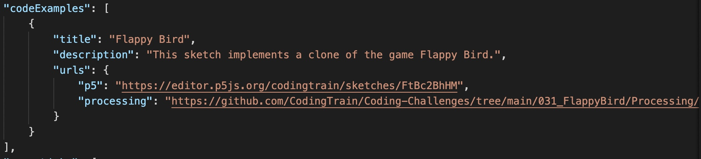
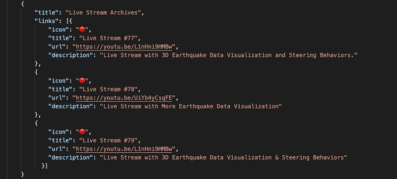
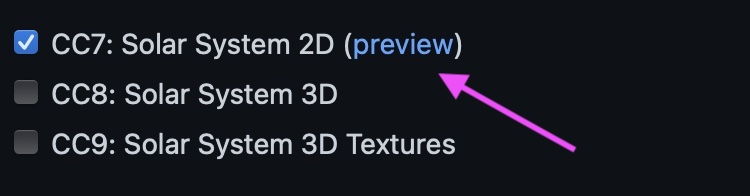

You want to help with integrating new content into the site? Great to hear that! Now let’s see how you can help:

A new Coding Train video has been released and you want to add it to the website so everyone else can find it there? You can look in this guide for a way to do that!

## Coding Challenges - Starting from a template

To indicate that you plan to port a coding challenge from the old website to the new one, add your github username in the "Claimed By" column of [this spreadsheet](https://docs.google.com/spreadsheets/d/1zt8KquMZN_j2-j4ezMsgeq-sRrgoCEAROwFS6LTS8oQ/edit#gid=1236591781).

Data from the old website was scraped into starter templates that [reside in a GitHub repo that can be found here](https://github.com/skaser85/thecodingtrain_website_data). Each template directory includes three items:

| Item       | Description                                                                                                                                                                           |
| ---------- | :------------------------------------------------------------------------------------------------------------------------------------------------------------------------------------ |
| index.json | Contains data scraped from the old website as well as data pulled from YouTube (e.g., tags and timestamps).                                                                           |
| index.jpg  | The thumbnail of the video from YouTube.                                                                                                                                              |
| showcase   | This directory contains a JSON file for each showcase that was listed on the old website. No screenshots exist for any of the contributions, so those will need to be added manually. |

### How to download a template directory

1. In the linked repo, navigate to the directory of the target challenge. For example, if the target challenge is number 103 - Fire Effect, click into the "challenges" folder, then click into the "103-fire-effect" folder.
2. Copy the URL in the address bar. For the example challenge, that would be: https://github.com/skaser85/thecodingtrain_website_data/tree/main/challenges/103-fire-effect


3. Go to https://minhaskamal.github.io/DownGit/. This website allows for a single resource from a GitHub repo to be downloaded instead of the needing to clone the entire repo.
4. Paste the URL into the text box.
5. Click the "Download" button to download a zip file of the challenge directory to wherever your downloads go.


6. On your machine, navigate to the downloaded zip file and extract its contents. After the files have been extracted, you should have a directory that looks like what's below:

```
   103-fire-effect
    |_ 103-fire-effect
       |- showcase
       |  |- contribution1.json
       |  |- ...
       |  |_  contribution*.json
       |- index.json
       |_ index.jpg
```

7. Copy the inner challenge directory (i.e., the directory that contains the "showcase" directory and the "index.json" and "index.jpg" files) to the "content/videos/challenges" directory of the "thecodingtrain.com" repo on your local machine.


8. The downloaded zip file and extracted files can be deleted from the directory they were downloaded to.

### What about multi-part Coding Challenges?

When a challenge spans multiple videos, the process is a bit more... challenging:

- First, download every directory for the challenge (for example `"54.1-islamic-star-patterns"` and `"54.2-star-patterns-update-law-of-sines"` for challenge 54).
- Then create only one directory for the challenge under `"content/videos/challenges"` (for example, named `"54-islamic-star-patterns"`).
- Keep only one of the `"showcase"` directories (they're the same for each part).
- The `"description"`, `"date"`, `"languages"`, `"topics"`, `"relatedChallenges"`, `"codeExamples"`, `"references"` and `"groupLinks"` should be merged into a single `"index.json"` for the challenge.
- Add a `"parts"` section inside `"index.json"` to set a `"title"`, `"videoId"` and `"timestamps"` for the different parts:

```json
{
  "title": "Islamic Star Patterns",
  "description": "In this bonus super-sized coding challenge, I work through visualizing Islamic Star Patterns in p5.js.",
  "videoNumber": "54",
  "videoId": "", <-- leave this empty
  "date": "2017-02-14", <-- date of first part
  "languages": ["p5.js", "javascript"],
  "topics": ["islamic star patterns", "hankins", "law of sines"],
  "canContribute": true,
  "relatedChallenges": [],
  "timestamps": [], <-- leave this empty
  "parts": [ <-- add this section
    {
      "title": "Part 1 - Implementing the Star Patterns",
      "videoId": "sJ6pMLp_IaI",
      "timestamps": [
        { "time": "00:00", "title": "Title 1" },
        { "time": "00:28", "title": "Title 2" }
      ]
    },
    {
      "title": "Part 2 - Refactoring using the Law of Sines",
      "videoId": "lobJ9gzbLo8",
      "timestamps": [
        { "time": "00:00", "title": "Title 1" },
        { "time": "00:28", "title": "Title 2" }
      ]
    }
  ],
  "codeExamples": [...],
  "groupLinks": [...]
}
```

### Next Steps

Once you have the template directory in the "challenges" folder, there are a number of things to check to ensure stale data is either updated or removed, and that thumbnail images and metadata get added. **Remember, this is an opportunity to clean up and improve the metadata!** Also, go ahead and re-watch the video to give yourself a better idea on what topics were discussed - this will also give you a chance to mark down timestamps and topics in the video, which can be added to the "index.json" file.

1. Before you make any changes, be sure to create a new branch so that you're not working out of the _main_ branch!
   - To create a new branch use the "git checkout -b **branch-name**" command in your terminal. Your branch name can be anything you want, but you may want to keep it short and relevant to this branch. For example, for the "103 - Fire Effect" coding challenge, you could make it something like "fire-effect-coding-challenge".

```console
git checkout -b branch-name
```

- When you go to _push_ this branch up to GitHub, you'll need to create a remote branch in GitHub to accept it. Use the "git push --set-upstream origin **branch-name**" command in your terminal to create the remote branch and push your changes up to it.

```console
git push --set-upstream origin branch-name
```


2.  Update the index image with "Coding Train" colors (optional).

- For consistency, all the index images are being updated. The new images are in color and (generally) no longer include Daniel Shiffman. They are displayed on the website at 16:9 aspect ratio, and ideally should have a 1280 by 720 resolution. They should be named index.jpg.
- If the original code has a square canvas, editing the size of the canvas--for example from (600,600) to (800,450) and translating to the center of the canvas will result in a better image. If the code uses the canvasWidth, it will probably also be necessary to replace canvasWidth with a new variable w which stores the original canvas width. If you prefer, you may leave the original index image and someone else will update the index image.
- [Coding Train colors](https://coding-train-colors.vercel.app)

3. Update links to code examples.
   - For the p5js examples, make sure the links listed really take you to the p5 Web Editor page that stores that project.
   - For the Processing projects, make sure the GitHub links take the user to the correct challenge directory at the [CodingTrain/Coding-Challenges](https://github.com/CodingTrain/Coding-Challenges/) repo.
   - The "other" property can be used for challenge-specific repos (refer to 171-wave-function-collapse).
   - If there is no challenge-specific repo, the "other" property can be deleted.



4. Add thumbnail images for code examples.

   - Each code example has an "image" property that should contain the file name of a screenshot of the running project. That image file is stored in the "images" directory within the challenge directory.
   - If the index image is appropriate for the code example image, you can omit adding an additional code image as the index image is the default code example image.


5. Remove broken showcase links.

   - Check each of the URLs in each of the showcases to ensure that the pages that are linked still exist. Sometimes the linked projects get deleted by the user who uploaded it.

6. Add thumbnail images for each showcase.

   - If you're able to run the project, create a thumbnail image for each showcase attached to the challenge.
   - Some projects will have been written in languages like Python or C++ which don't, by default, lend themselves very nicely to the web. Sometimes these projects are hosted on sites where previews of the running project are available. If so, grab a screenshot of the running project to use as the thumbnail for that project. If not, the placeholder image will be used.
   - To add a thumbnail image, copy the image file into the "showcase" directory within the challenge's directory and re-name the image so that it matches the filename of the contribution's JSON file. For example, if you have a "contribution1.json" file, you should also have a "contribution1.jpg" file. While any aspect ratio is fine (the site will resize and crop as necessary), the images will be displayed at 16:9 aspect ratio. If you able to get a "landscape" screenshot, it will look better. The file format should be JPG or PNG, with a maximum width of 800px and file size of 500 kb.

7. Check the links to the references and videos to make sure are not broken and add additional metadata. Add a link (s) to any archived Live Streams associated with the challenge.

   - For accessibility and for general clarity, ensure that all "description" properties in the index.json file as well as the contribution JSON files are filled in with at least 1 sentence.
   - Update the "languages" property in the "index.json" file. In this instance, "languages" refers to the programming language(s) used in the challenge. For example: "p5.js", "JavaScript", "Processing", or "node.js".
   - Update the "topics" property in the "index.json" file. If any tags were present on the YouTube page of the challenge, those would have been brought over by the web scraper and included as "topics". The tags from YouTube are pretty generic and overall too much information. Only a handful of topics are needed, so only include topics that are relevant to this specific video. If no tags were present on the YouTube page, then this may be blank - go ahead and add a couple of topics!
   - Use the Description on the YouTube video for additional links to add as "References" or "Videos" in the "groupLinks" property in the "index.json" file. Also, add in links to Wikipedia about whatever concept is being discussed, or links to p5.js or Processing documentation about any special functions that are used in the video, or links to whatever other resource may help to further explain a concept.
   - If there are multiple Live Streams associated with the challenge, add a new group `"Live Stream Archives"`.

   

8. Add time codes for the video.
   - The "timestamps" property in the "index.json" file may contain time codes that were pulled in from the YouTube video. If those didn't exist for the YouTube video, go ahead and add those time codes.


9. Replace any links to the old website with links to the new website.

   - Some links in the "index.json" file may refer to other challenges or other parts of the old website which will need to be updated. If the link is to a video that has not been ported to the new website yet, update the URL to directly link to the youTube URL.

10. Optionally, add an emoji to the links in the References or Videos section of the "index.json" file.

- Emoji help to add some fun and character to an otherwise plain list of links.
- In any of the "links" property lists, use the "icon" property to add an emoji.


### Create a Pull Request on GitHub

Once all updates have been made to the Coding Challenge and the branch has been pushed up to GitHub, go to the webpage for your forked repo on GitHub. You should see a yellow message box with the name of your branch and a button with the text "Compare & pull request". Click that button to open the page to create a pull request into the _main_ repo.


Add a title to the pull request on the new page. Optionally, add a message about the changes made. Including a link to the preview page would also be very helpful. For example, https://deploy-preview-644--codingtrain.netlify.app/challenges/7-solar-system-2d



Click the "Create a pull request" button to finish creating the pull request.


The Netlify bot will start running tests on your pull request. If everything passes, someone one on the Coding Train team will review your pull request. They may have questions about it or offer suggestions to improve it. If you end up needing to make changes, you can make them in the branch in your local repo. When you push the changes up to GitHub, they will automatically show up as an update in the pull request. Once all changes have been made to the pull request, the pull request will be merged. Congrats!!!


Once your pull request has been merged, you can write "yes" in the "Ported" column of [this spreadsheet](https://docs.google.com/spreadsheets/d/1zt8KquMZN_j2-j4ezMsgeq-sRrgoCEAROwFS6LTS8oQ/edit#gid=1236591781) and add the name of the challenge directory you added in the "Directory Name" column.

## Coding Challenges - Adding video

If you want to manually add a new (or old) challenge video to the site, you can follow these instructions.

Make a folder for the video inside `content/videos/challenges`. The folder title should be formatted as `#-name-of-challenge`, replacing '#' with the challenge's number. Add a file named `index.json` to the folder.

Then copy the template into the `index.json`:

```json
{
  "title": "Video title",
  "description": "Video description",
  "videoNumber": "Video number",
  "videoId": "YouTube video ID",
  "date": "YYYY-MM-DD",
  "languages": ["language1", "language2"],
  "topics": ["topic1", "topic2"],
  "canContribute": true,
  "relatedChallenges": ["number-challenge-1", "number-challenge-2"],
  "timestamps": [
    { "time": "0:00", "title": "Title 1" },
    { "time": "1:26", "title": "Title 2" },
    { "time": "3:40", "title": "Title 3" }
  ],
  "parts": [
    {
      "title": "Part 1 - Specific Title for Part 1",
      "videoId": "YouTube video ID for Part 1",
      "timestamps": [
        { "time": "0:00", "title": "Only for multi-part challenges" },
        { "time": "1:26", "title": "Remove this 'parts' section for single-part challenges" }
      ]
    },
    {
      "title": "Part 2 - Specific Title for Part 2"
      "videoId": "YouTube video ID for Part 2",
      "timestamps": [
        { "time": "0:00", "title": "Title 1" },
        { "time": "1:26", "title": "Title 2" }
      ]
    }
  ],
  "codeExamples": [
    {
      "title": "Code example 1 title",
      "description": "Code example 1 description",
      "image": "image1.png",
      "urls": {
        "p5": "url to p5 editor or code",
        "processing": "url to processing sketch",
        "other": "url to other source, like GitHub"
      }
    },
    {
      "title": "Code example 2 title",
      "description": "Code example 2 description",
      "image": "image2.png",
      "urls": {
        "other": "url to other source, like GitHub"
      }
    }
  ],
  "groupLinks": [
    {
      "title": "Group of links title",
      "links": [
        {
          "title": "Link 1 title",
          "url": "link 1 url",
          "description": "description of content linked"
        },
        {
          "title": "Link 2 title",
          "url": "link 2 url",
          "description": "description of content linked"
        }
      ]
    }
  ]
}
```

Then edit this template and fill it with all the video's metadata. Most keys should explain themselves (we hope!), except maybe the following:

The `"videoNumber"` key is important for challenges! It should match the challenge number.

The `"languages"` and `"topics"` refer to ways of tagging the content of the video, with the coding languages present in the video and the themes being worked on the video. Don't add more than two tags for each video (two languages and two topics).

The `"canContribute"` key sets if the passenger showcase for the video will be shown. Challenges should be set to `true`, other videos may vary.

The `"relatedChallenges"` key specifies an array of challenges that relate to the new video. It may be an empty array.

The `"parts"` section is only needed for multi-part coding challenges. It should contain a `"title"`, the YouTube `"videoId"` and the `"timestamps"` for each part of a multi-part challenge. The `"title"` should follow this format: `"Part 1 - Part-Specific Title"`. This `"parts"` section should be removed entirely for single-part challenges.

For the `"codeExamples"` section, each code example should at least contain one URL to the code in the `"urls"` object. The keys for that object `"p5"`, `"processing"` or `"node"` reference the possible languages we support for icons, and `"other"` is a fallback option in case none of the previous ones apply.

Also, each code example can have a thumbnail linked to it using the `"image"`key. You should also add the corresponding image to the file system, in an `images/` folder inside the video folder.

For the `"groupLinks"` section, links to other pages, such as Wikipedia articles, blog posts, and documentation entries should be put in a `"References"` group. Links to videos should be put in a `"Videos"` group. If there is more than one archived Live Stream associated with the challenge, create a new group called `"Live Stream Archives"`.

### Adding video thumbnail

You can also add a thumbnail for the video! To do that, just add an image file (either PNG or JPG) to video's folder, next to `index.json`, and call it `index.png` or `index.jpg`.

The site will generate multiple different sized version for the image, so you shouldn't worry about adding multiple images. But, in general it's better to provide a bigger image so that all sizes are of good quality.

## Tracks - Adding video

If you want to add a new (or old) video that belongs to a track to the site, you can follow these instructions.

Find the track to which the video belongs. Track folders are found in `content/videos/tracks`, either inside of `main-tracks/` or `side-tracks/`. If the video's track doesn't exist yet, check the [create track section](#tracks---adding-new-track).

Then, add a folder for the video in `content/videos/`, it should be formatted as `"name-of-video"`. Then, follow the steps for adding a coding challenge, adding the `index.json` into the newly created video folder. In this case, the video number is not relevant.

If the video had community contributions, create a `showcase` folder and add individual JSON files for each showcase with the contribution metadata in them. You can add the metadata in JSON format manually, or you can use [this python script](https://github.com/DenisovichDev/codingtrain-contribution-util) to generate them. The instructions on how to use the script could be found in the `README` of the GitHub repository. After generating the JSON files, add thumbnails for each of them, following [these instructions](#coding-challenges---starting-from-a-template).

You can also nest that video folder further in the folder organization. To do that, check the [videos in nested folders section](#videos-in-nested-folders).

Finally, make sure that the newly added video's folder name (let's say `"name-of-video"`) is present in the corresponding track's `index.json` file in the position you feel is right in the track's organization (if the video is further nested inside of `content/videos/`, check [videos in nested folders section](#videos-in-nested-folders).).

### Adding track thumbnail

You can also add a thumbnail for the track! To do that, just add an image file (either PNG or JPG) to tracks's folder, next to `index.json`, and call it `index.png` or `index.jpg`.

The site will generate multiple different sized version for the image, so you shouldn't worry about adding multiple images. But, in general it's better to provide a bigger image so that all sizes are of good quality.

## Tracks - Adding new track

Navigate to `content/tracks/main-tracks` or `content/tracks/side-tracks` (depending on the type of track) and create a folder for the track, it should be formatted as `"name-of-track"`. Then create a `index.json` file for the track inside of that folder.

To decide whether the track is a Main Track or a Side Track:

- Main Tracks follow a linear progression, with each new video building on skills learned in the previous video
  - An example of a Main Track would be "The Nature of Code 2" track
- Side Tracks are organized around a central theme or idea, and don't necessarily follow a linear progression
  - An example of a Side Track would be the "2018 Workflow" track

Once you've created the folder and file inside of either `content/tracks/main-tracks` or `content/tracks/side-tracks`, then you should fill out the track's metadata. There's two ways of organizing the tracks' videos: through a `"chapters"`key or a `"videos"`key.

On the one hand, `"chapters"` organizes videos as an ordered sequence of chapters, where each is an ordered array of videos. Each chapter should also have a `"title"` defined. To reference specific video, you should use reference the name of the corresponding video inside of `content/videos/`. To follow the chapter structure, you can copy the following template:

```json
{
  "title": "Track title",
  "description": "Track description",
  "chapters": [
    {
      "title": "First chapter title",
      "videos": ["name-of-video-1", "name-of-video-2"]
    },
    {
      "title": "Second chapter title",
      "videos": ["name-of-video-3", "name-of-video-4"]
    }
  ]
}
```

On the other hand, `"videos"` is just a plain array of video names. To follow the videos structure, you can copy the following template:

```json
{
  "title": "Track title",
  "description": "Track description",
  "videos": ["name-of-video-1", "name-of-video-2", "name-of-video-3"]
}
```

## Create a Pull Request

Whenever you've finished working you can submit a pull request so that your
changes get merged into the actual website. If you don't know how to do so,
have a look at this handy
[guide](https://docs.github.com/en/get-started/quickstart/contributing-to-projects#making-a-pull-request)
from GitHub.

## Troubleshooting

Sometimes, things don't work like they should. If you get stuck, don't worry!
Feel free to ask for help at any time, file an issue or come say hello in the [Coding Train Discord](/discord).

## Adding a New Event

If you'd like to an event to the Coding Train homepage you will need to edit the `content/pages/homepage/index.json` file. By adding a new event object to the `events` object's array of `"upcoming"` events. Note, if there are currently no upcoming events then `"upcoming"` will be an empty array like `"upcoming": []`.

```json
  "upcoming": [{
        "title": "Neuroevolution - the Nature of Code",
        "description": "Watch as Dan steps through each of these fun challenges, then put your new knowledge to work and create your own projects.",
        "date": "2022-07-16",
        "time": "20:00",
        "host": "dan Shiffman",
        "type": "Livestream",
        "url": "https://www.youtube.com/channel/UCvjgXvBlbQiydffZU7m1_aw"
  }]
```

Now let's take a closer look at each property:

| Property | Description                                                | Example                                                    |
| -------- | ---------------------------------------------------------- | ---------------------------------------------------------- |
| `title`  | Official event title                                       | `"Neuroevolution - the Nature of Code"`                    |
| `date`   | The scheduled date for the event                           | `2022-07-16`                                               |
| `time`   | The schedule time for the event                            | `"20:00"`                                                  |
| `host`   | Path to the corresponding code files inside the repository | "dan Shiffman",                                            |
| `type`   | Is the event in person? online?                            | `irl/livestream...`                                        |
| `url`    | Website where can attendees register or attend event.      | `https://www.youtube.com/channel/UCvjgXvBlbQiydffZU7m1_aw` |

## Videos in nested folders

The `videos/`, and `videos/challenges/` folders' folder definitions can be further organized in arbitrary nested folders in any fashion that makes sense.

When doing this, tracks and videos that reference videos in nested folders must use the whole relative path to specifically reference the video instead of just using the folder slug.

For instance, videos may be organized based on the tracks and chapters that define them:

```
videos
├─ challenges/
└─ track-name
   ├─ chapter-1
   │  ├─ video-1-slug
   │  │  └─ index.json
   │  └─ video-2-slug
   │     └─ index.json
   └─ chapter-2
      ├─ video-3-slug
      │  └─ index.json
      └─ video-4-slug
         └─ ...
```

This would result in less folders directly inside of `videos`.

To reference it in a track, the relative paths from `videos` should be used.

```json
{
  "title": "Track title",
  "description": "Track description",
  "chapters": [
    {
      "title": "First chapter title",
      "videos": [
        "track-name/chapter-1/video-1-slug",
        "track-name/chapter-1/video-2-slug"
      ]
    },
    {
      "title": "Second chapter title",
      "videos": [
        "track-name/chapter-2/video-3-slug",
        "track-name/chapter-2/video-4-slug"
      ]
    }
  ]
}
```

```json
{
  "title": "Track title",
  "description": "Track description",
  "videos": [
    "track-name/chapter-1/lesson-1-slug",
    "challenges/video-2-slug",
    "video-3-slug"
  ]
}
```
