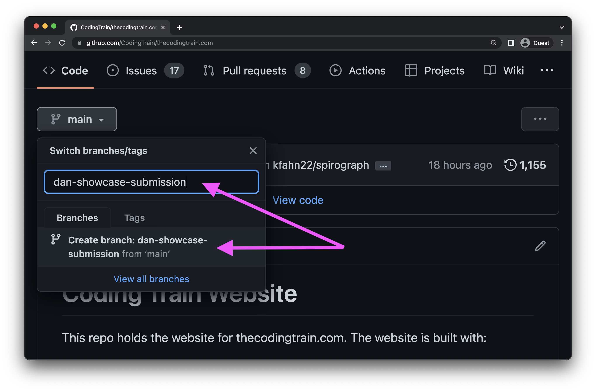

Thank you for sharing your work in the Passenger Showcase! In the future, we hope to provide a form to make the submission process easier, but for now, please follow the instructions below to create a pull request for your project! If you have questions or need any help, come board the [Coding Train Discord](https://discord.gg/6DScedrtvH) or write to help@thecodingtrain.com.

This guide is in progress, and will be updated as the contribution process changes.

## Finding the video folder

On the repo homepage, click the button in the upper left-hand corner where it says `main`. Type in the name of a branch (you can make this up!), in the example I'm calling it `dan-showcase-submission` and create the branch!



Navigate to the video folder the contribution belongs to:
If the video is a coding challenge, then the video will be in `content/videos/challenges/number-challenge-name`.

If the video is a part of a series, chances are it is either in a main or side track on the site, both of which are found in `content/videos/tracks/`.

## Creating the contribution file

If someone has already submitted a contribution. you will see a `showcase` folder.  Click "Add file" in the upper right-hand corner and click "Create new file" (or "Upload files'', if you already have the contribution on your local machine).  Name the file `contribution2.json`, if that exists `contribution3.json`, etc).  If there are no submissions yet, name the file `showcase/contribution1.json`.  


Copy the template into the new file:

```js
{
  "title": "Project Title",
  "author": {
    "name": "Your Name (or nickname!)",
    "url": "Link to more about you! (your personal site, GitHub, social media, etc.)"
  },
  "url": "Link to your project",
  "source": "Link to your source code (if different than project link)"
}
```


Fill out the title, name, url, etc. Once everything is filled out, click the green button below the editor that says "Commit new file".


## Submitting the pull request

Click "thecodingtrain.com" in the repo title to return to the main branch, then click "Compare & pull request" (or go to the “Pull requests” tab and create a pull request by clicking "New pull request", then clicking "compare: main" and choosing `community-contributions` from the dropdown)


A member of the Coding Train team will review your pull request and merge it into the site!
