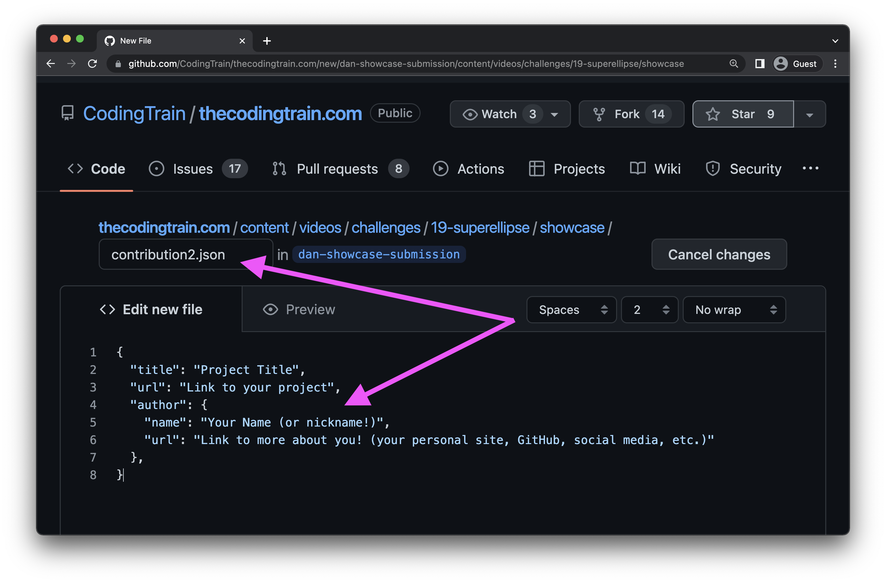
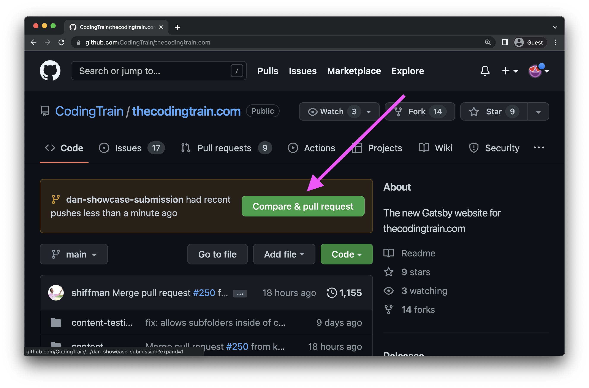

## Submission Form

Thank you for sharing your work in the Passenger Showcase! There are currently two ways to submit your work: by using this form to upload your work, or to follow the instructions below to create a Pull Request for your project on GitHub!

<PassengerShowcaseForm />

If you have questions or need any help, come board the [Coding Train Discord](https://thecodingtrain.com/discord) or write to help@thecodingtrain.com. This guide is in progress, and will be updated as the showcase submission process changes.

## Finding the Video on GitHub

If you choose not to use the form above, you can also submit a Pull Request on GitHub. The first step is to associate your submission with a specific video. Don't worry too much if you aren't sure, just pick wherever you think it fits best! If your work relates to multiple videos just pick one!

On the [GitHub repo homepage](https://github.com/CodingTrain/thecodingtrain.com), click the button in the upper left-hand corner where it says `main`. Type in the name of a branch (you can make this up!) and create the branch! In the example below I'm calling it `dan-showcase-submission`.


Navigate to the video folder. If the video is a coding challenge, then the video will be in `content/videos/challenges/number-challenge-name`.

If the video is a part of a series, chances are it is either in a main or side track on the site, both of which are found in `content/videos/`. If you can't find it, [file an issue to ask](https://github.com/CodingTrain/thecodingtrain.com/issues)!

## Creating the Showcase JSON File

If the video already has showcase projects. you will see a `showcase` folder. Click "Add file" in the upper right-hand corner and click "Create new file" (or "Upload files'', if you prefer to create the file on your local machine). Name the file `contribution2.json`, if that exists `contribution3.json`, etc). If you are the first one, name the file `showcase/contribution1.json` (this will create the folder too!)


Copy the template into the new file:

```js
{
  "title": "Project Title",
  "url": "Link to your project",
  "author": {
    "name": "Your Name (or nickname!)",
    "url": "Link to more about you! (your personal site, GitHub, social media, etc.)"
  },
  "submittedOn": "YYYY-MM-DD"
}
```



Fill out the title, name, url, etc. Your URL can be anything, a p5 sketch, a blog post, GitHub repo, YouTube video, etc. After you've completed the data, click the green button below the editor that says "Commit new file".


## Adding a Preview Image

All showcase submissions should include a thumbnail preview image! While any aspect ratio is fine (the site will resize and crop as necessary), the images will be displayed at 16:9 aspect ratio. We suggest you upload a "landscape" image. The file format should be `JPG` or `PNG`, with a maximum width of 800px and file size of 500 kb. Name your thumbnail image with the same filename as your showcase submission (`contribution1.png`, `contribution2.jpg`, etc.). You can drag and drop the image file into the same directory to add it to the pull request!


## Submitting a Pull Request

[Return to the main branch](https://github.com/CodingTrain/thecodingtrain.com/tree/main), and select "Compare & pull request" (or go to the “Pull requests” tab and create a pull request by selecting "New pull request", then "compare: main" and choosing `your-branch-name` from the dropdown)




A member of the Coding Train team will review your pull request and merge it into the site!
